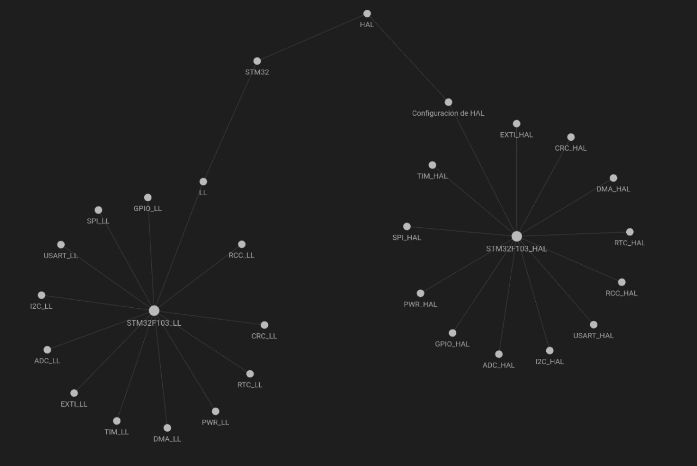

# Repositorio de ejemplos para STM32F1

## Como colaborar

* Hacer Fork de este repositorio
* Clorar repositorio Forkeado
* Crear rama con el nombre que desee *por ejemplo: SPI_dev*
* Desarrollar el ejemplo con las **Condicines**
* Generar un push request

## Condiciones

En la carpeta [STM32 Blue Pill](STM32_bluepill) existen 2 carpetas una llamada [LL](STM32_bluepill/LL) y otra llamada [HAL](STM32_bluepill/HAL) dependiendo de que vaya tu ejemplo la colocas en una carpeta u otra. la idea es completar los todos los items de la imagen acontinuacion:

Los colaboradores tendran mension honorifica en la web de [open Harware Latinoamerica](https://openhardwarela.com/)
