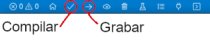

# Ejemplos utilizando libOpenCM3

## libOpenCM3

Esta **API/HAL** de hardware open-source con licencia GPLv3 es un desarrollo comunitario que puede seguir a través de su [repositorio oficial de github](https://github.com/libopencm3/libopencm3). A diferencia de otras herramientas, ésta no depende del fabricante o desarrollador del CPU o µControlador, sino que está desarrollada y mantenida por la comunidad. Esto presenta desventajas y otras ventajas, pero muchas potencialidades.

En principio es un proyecto que daba soporte solamente a micros con ARM® Cortex&trade;-M3 de *STMicroelectronics*, pero debido a la comunidad y el uso libre de colaborar, rápidamente se expandió a otros modelos y fabricantes. La mayor ventaja, desde el punto de vista de la comunidad, es que puede tomar este proyecto y mejorarlo Ud. mismo, agregando o modificando lo que crea pertinente. Hacer su propia base de código o ayudar al desarrollo oficial a completarse.

Las desventajas son dos, notodos los modelos están completamente soportados al día de hoy (especialmente los que no son de STM) y en la API todavía se están tomando decisiones en cuanto a nomenclatura y aplicaciones. Es decir, que podría cambiar la manera de trabajo en futuros commits.

En estos ejemplos utilizaremos PlatformIO y la versión de libOpenCM3 que se distribuye con este proyecto. Es decir que no utilizaremos la última versión del repositorio, por una cuestión de comodidad.

## PlatformIO

[PlatformIO](https://platformio.org/) es un IDE Open-Source que se instala como extensión o plug-in en otros softwares de desarrollo. El recomendado oficialmente es [VSCode](https://code.visualstudio.com/). Este IDE tiene la ventaja de ofrecer soporte para muchísimo hardware de diversos fabricantes y herramientas de desarrollo. Además de tener un robusto manejo de dependencias, testing y debugging. Otra gran ventaja es que no solo hablamos de dependencias de bibliotecas (libs) que utiliza nuestro software, sino que también las herramientas de desarrollo y sus versiones son tomadas como dependencias. Es decir, PlatfromIO se encarga de descargar y configurar las herramientas necesarias para compilar, grabar y debuggear nuestro proyecto cuando lo necesitemos.

Además, al ser un proyecto open-spurce, puede ir a [su página de github](https://github.com/platformio) y proponer cambios, colaborar, subir sus propios ejemplos o reportar problemas.

Además tiene un sistema de publicación de bibliotecas (libs), con lo cual, puede aportar a la comunidad también desde allí.

## Entorno de desarrollo

### Instalación

En este video se muestra como instalar el entorno de desarrollo y algunas de sus características:

[](https://www.youtube.com/watch?v=1AGaJZpZDSg)

### Crear un proyecto nuevo

Con el siguiente paso a paso puede generar un proyecto vacío para empezar a desarrollar.

1. Primero haga clic en `+ New Project` para generar un nuevo proyecto.


2. Se habrirar una pantalla donde deve colocar nombre al proyecto, con qué placa o µControlador va a trabajar y qué herramienta de desarrollo utilizar. En este caso será `BluePill F103C8` o `BluePill F103C8 (128k)` según corresponda y `libOpenCM3`:


3. Esto genera una estructura básica de proyecto. En la carpeta `src` debe agregar sus archivos `.c` o `.cpp` respectivamente:


4. Ya puede empezar a codificar cualquiera de los ejemplos propuestos.

### Compilar y Cargar el firmware

Para compilar o grabar, puede utilizar la barra inferior donde tiene las tareas correspondientes:



Por defualt se utilizará el `ST-LinkV2` como herramienta de carga de firmware y debuggin. Si necesita utilizar otras herramientas puede optar por alguna de las correspondientes en el archivo `platformio.ini`:

```ini
; Para Blackmagic:
upload_protocol = blackmagic

; Para grabar por USART1 => PA9-PA10 (BOOT0=1, BOOT1=0)
upload_protocol = serial

; Para dap boot por medio del USB (BOOT0=0, BOOT1=1)
upload_protocol = dfu
upload_command = $PROJECT_PACKAGES_DIR/tool-dfuutil/bin/dfu-util -D $SOURCE
```

#### Referencias

* [Black Magic Probe](https://black-magic.org/)
* [dapboot](https://github.com/devanlai/dapboot)

## Troubleshooting

### Chip con firma diferente

Si posee un chip clon (CKS32/CS32) con firma ID `0x2ba01477` puede agregar lo siguiente al `platformio.ini`:

```ini
upload_flags = -c set CPUTAPID 0x2ba01477
```

### Agregar `.rules` en GNU/Linux

En linux debe agregar un archivo para que el sistema reconozca los dispositivos usb para grabar y depurar, según la [documentación de PlatformIO](https://docs.platformio.org/en/stable/core/installation/udev-rules.html) puede hacerlo de la siguiente manera:

```bash
curl ‐fsSL https://raw.githubusercontent.com/platformio/platformio‐core/master/scripts/99‐
platformio‐udev.rules | sudo tee /etc/udev/rules.d/99‐platformio‐udev.rules
```

Como el `dapboot` no está soportado oficialmente, podría necesitar una regla especial para este `99-dapboot.rules`:

```bash
ATTRS{idVendor}=="1209", ATTRS{idProduct}=="db42", MODE:="0666", ENV{ID_MM_DEVICE_IGNORE}=
"1", ENV{ID_MM_PORT_IGNORE}="1"
```